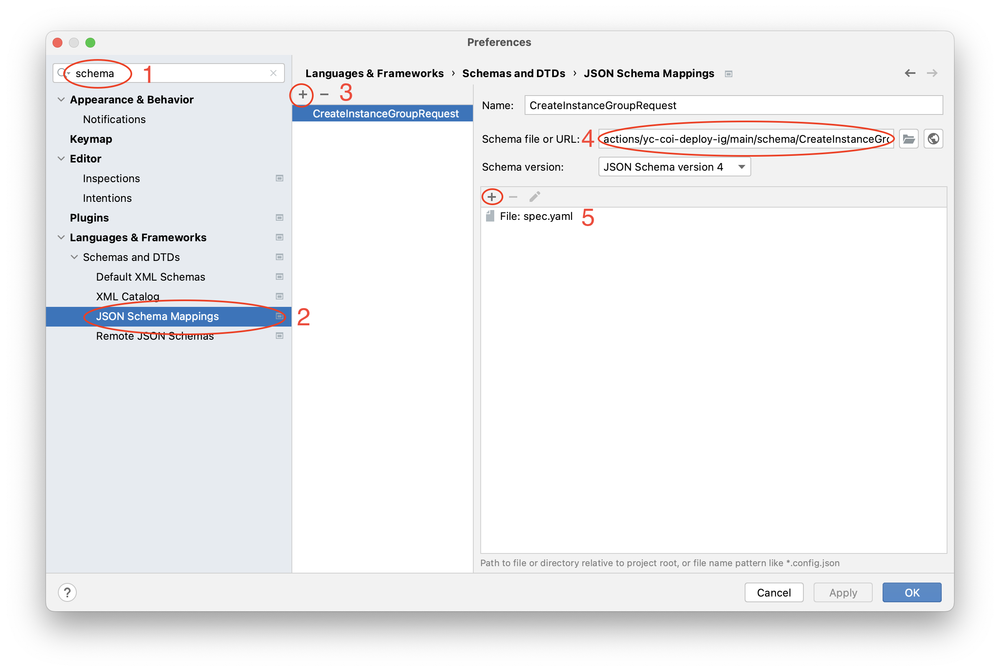
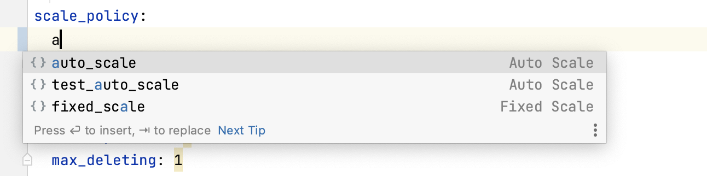

## GitHub Action to deploy your container into Yandex Cloud instance group created from Container Optimized Image.

The action creates a Instance Group with the provided name in the provided folder if there is no one. Then it deploys a container
using the provided image name and tag.

**Table of Contents**

<!-- toc -->

- [Usage](#usage)
- [Permissions](#permissions)
- [License Summary](#license-summary)

<!-- tocstop -->

## Usage

```yaml
    - name: Login to Yandex Cloud Container Registry
      id: login-cr
      uses: yc-actions/yc-cr-login@v1
      with:
        yc-sa-json-credentials: ${{ secrets.YC_SA_JSON_CREDENTIALS }}

    - name: Build, tag, and push image to Yandex Cloud Container Registry
      env:
        CR_REGISTRY: crp00000000000000000
        CR_REPOSITORY: my-cr-repo
        IMAGE_TAG: ${{ github.sha }}
      run: |
        docker build -t cr.yandex/$CR_REGISTRY/$CR_REPOSITORY:$IMAGE_TAG .
        docker push cr.yandex/$CR_REGISTRY/$CR_REPOSITORY:$IMAGE_TAG

    - name: Deploy COI Instance Group
      id: deploy-coi
      uses: yc-actions/yc-coi-deploy-ig@v1
      env:
        CR_REGISTRY: crp00000000000000000
        CR_REPOSITORY: my-cr-repo
        IMAGE_TAG: ${{ github.sha }}
      with:
        yc-sa-json-credentials: ${{ secrets.YC_SA_JSON_CREDENTIALS }}
        folder-id: bbajn5q2d74c********
        ig-spec-path: './spec.yaml'
        user-data-path: './user-data.yaml'
        docker-compose-path: './docker-compose.yaml'
```

Data from files `./spec.yaml`, `user-data.yaml`, and `docker-compose.yaml` will be passed to the Mustache template renderer,
so there could be used environment variables substitution via `{{ env.VARIABLE }}` syntax.  

See [action.yml](action.yml) for the full documentation for this action's inputs and outputs.

## Permissions

To perform this action, it is required that the service account on behalf of which we are acting has granted 
the `compute.admin`, `vpc.admin`, and `iam.serviceAccounts.user` roles or greater.

## License Summary

This code is made available under the MIT license.

## Adding schema validation for spec.yaml in JetBrains IDEs

In the IDE press `cmd + ,` to open Preferences dialog.
1. Then type `schema` in the search input
2. Select `JSON Schema Mappings`
3. Add new mapping
4. Insert `https://raw.githubusercontent.com/yc-actions/yc-coi-deploy-ig/main/schema/CreateInstanceGroupRequest.json`
    into Schema file or URL input
5. Add file or pattern to apply the schema to.



Now you'll get some suggestions when you'll type. Also, param types are checked and errors are highlighted.

